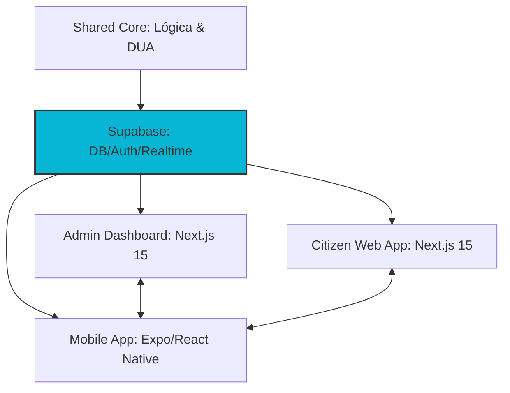

# 🛡️ BuscoHuella — Roadmap Vision 2026 (v5.6)

> **"La identidad es protección. La información es seguridad."**
> **Estado:** Fase 2 - Data Modeling (DUA Implementation)
> **Nodo Maestro:** Sabadell Alpha | **Protocolo:** DUA v2.1
> **Sincronización:** 24 de Marzo, 2026

---

# 🌍 Visión Estratégica

BuscoHuella es la infraestructura de identidad animal más segura e inteligente del mundo. Nuestra misión es establecer el estándar operativo para **Smart Cities**, garantizando que cada activo animal tenga una identidad verificable, una historia auditable y protección activa mediante nuestra malla geotáctica.

---

# 🧩 Principios del Sistema (The Bunker Code)

### 1. Privacy-First

Cifrado **AES-256** para datos sensibles. Acceso granular basado en la jerarquía operativa (RBAC) y cumplimiento estricto de **GDPR**.

### 2. Resiliencia Operativa

Arquitectura diseñada para alta disponibilidad y funcionamiento en condiciones de baja conectividad mediante sincronización diferida.

### 3. Identidad Verificable (DUA)

Implementación del **Digital Unique Animal (DUA)**: un hash de integridad que vincula biometría, microchip y titularidad de forma inmutable.

### 4. Infraestructura Abierta

Interoperabilidad total con servicios de emergencia, clínicas veterinarias y censos municipales.

---

# 🏗️ Arquitectura de Malla (System Topology)

## 🛰️ Diagrama de Inteligencia

## 💻 Stack Tecnológico (Bunker Core)

| Capa             | Tecnologías                                 |
| :--------------- | :------------------------------------------ |
| **Framework**    | Next.js 15+ / React 19 / App Router         |
| **Backend**      | Supabase (Postgres, Auth, Realtime)         |
| **Arquitectura** | Monorepo / Shared Core (DUA Validations)    |
| **UI / UX**      | Tailwind CSS / Framer Motion / Lucide Icons |

---

# 🚀 Fase Actual: Fase 2 - Inteligencia de Datos

Monitorización del despliegue del protocolo DUA en el Nodo Sabadell.

### 📟 Dashboard de Administración (Alpha Layer)

- [x] **Live Telemetry:** Pulso de red y reloj de sincronización operativa.
- [x] **Sincronización por URL:** Filtros reactivos para control sectorial global.
- [x] **DUA Hash Engine:** Generación de identificadores únicos inmutables.
- [x] **Audit Logs:** Trazabilidad de operaciones por Archon/Operador.
- [x] **Centro de Inteligencia de Incidencias v1.0:** Archivo Central con filtrado en servidor, búsqueda universal reactiva (Mensaje, Sector, REF_ID) con columna virtual `id_search` + `pg_trgm`, filtrado por rango de fechas, acciones masivas (resolución/purga en bloque), exportación CSV y menú social. (`e5bf9d3`)

---

# 👥 Jerarquía de Roles (Operational Ecosystem)

| Rango         | Nivel          | Responsabilidad                                    |
| :------------ | :------------- | :------------------------------------------------- |
| **Archon**    | L0 - Root      | Control total del búnker y auditoría de seguridad. |
| **Authority** | L1 - Official  | Gestión de crisis, robos y seguridad pública.      |
| **Vet**       | L2 - Validator | Validación sanitaria y certificación de DUA.       |
| **NGO**       | L2 - Operative | Rescate, logística de campo y adopciones.          |
| **Citizen**   | L3 - Node      | Custodia de activos y reportes de proximidad.      |

---

# 🏗️ Malla Geotáctica (Grid Control)

El territorio se divide en cuadrantes inteligentes gestionados mediante:

1. **Manual Entry:** Asignación directa por el operador en el registro.
2. **Reverse Geocoding:** Dirección física ➔ Coordenadas ➔ ID de Sector.
3. **Active Geofencing:** Identificación por GPS mediante la terminal móvil.

---

# 🛠️ Ideas Futuras (Backlog de Módulos)

### 📊 Gestión Superior

- **Censo Maestro:** Supervisión de la relación Activo-Ciudadano.
- **Sector Editor:** Modificación dinámica de polígonos de patrulla.
- **Bunker Monitor:** Modo pausa de sistema y alertas de seguridad IP.

### 💬 Tactical Comms

- **Internal Chat:** Comunicación cifrada entre organizaciones.
- **Broadcast Alerts:** Notificaciones push segmentadas por riesgo y sector.

### 🧠 Archon Intelligence (IA Operativa)

- **Predictive Routes:** Análisis orográfico para búsqueda de perdidos.
- **Vision AI:** Reconocimiento de patrones visuales para match animal.
- **Archon Bot:** Consultas al censo mediante lenguaje natural.

---

# 🗺️ Modelo de Expansión

- **Local:** Sabadell Alpha (Piloto).
- **Regional:** Corona metropolitana (Barcelona).
- **Nacional:** Interconexión estatal de búnkeres.

---

# ⏳ Timeline Operativo

- **v5.1:** Incidencias de campo reales y geolocalización activa.
- **v5.2:** Tactical Comms (Mensajería inter-rango).
- **v6.0:** Lanzamiento de Terminal Móvil (Mobile App).

---

# 🧬 Filosofía del Proyecto

BuscoHuella es un **sistema vivo**.  
Cada línea de código es una **huella protegida**.
